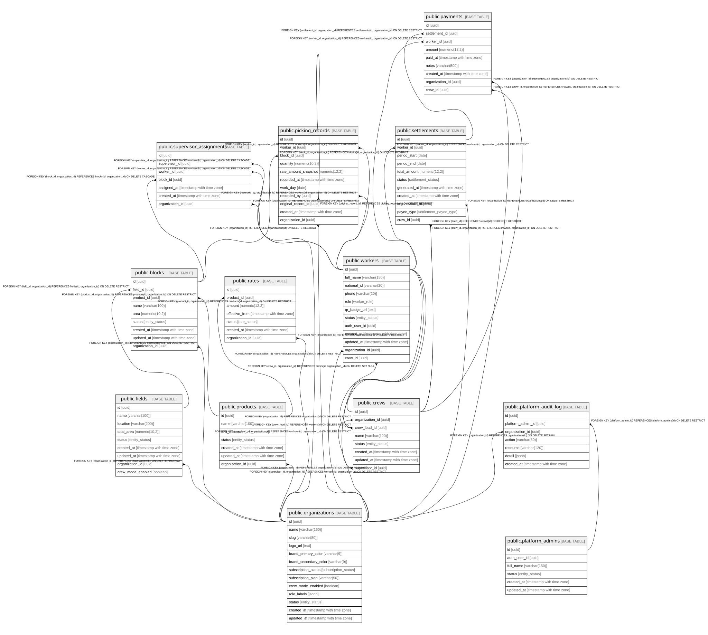

# postgres

## Tables

| Name                                                              | Columns | Comment                                                                                          | Type       |
| ----------------------------------------------------------------- | ------- | ------------------------------------------------------------------------------------------------ | ---------- |
| [public.products](public.products.md)                             | 7       | Catalogue of harvestable products (fruit types)                                                  | BASE TABLE |
| [public.fields](public.fields.md)                                 | 9       | Farm/fundo - top-level productive unit                                                           | BASE TABLE |
| [public.blocks](public.blocks.md)                                 | 9       | Block/paño - subdivision of a field, linked to a product                                         | BASE TABLE |
| [public.rates](public.rates.md)                                   | 7       | Price rates per unit (box/kg) for each product. Only one current rate per product at any time.   | BASE TABLE |
| [public.workers](public.workers.md)                               | 12      | Farm workers, supervisors, and admins. Linked to Supabase Auth.                                  | BASE TABLE |
| [public.supervisor_assignments](public.supervisor_assignments.md) | 7       | Maps supervisors to the workers and blocks they manage.                                          | BASE TABLE |
| [public.picking_records](public.picking_records.md)               | 11      | Individual harvest entries. Each record = one delivery of boxes/kg by a worker.                  | BASE TABLE |
| [public.settlements](public.settlements.md)                       | 11      | Calculated payment due for a worker over a date range.                                           | BASE TABLE |
| [public.payments](public.payments.md)                             | 9       | Actual payments made against settlements.                                                        | BASE TABLE |
| [public.organizations](public.organizations.md)                   | 13      | Cliente/tenant del SaaS. Unidad de aislamiento de datos.                                         | BASE TABLE |
| [public.platform_admins](public.platform_admins.md)               | 6       | Administradores de plataforma (dueño/soporte del SaaS). Fuera del aislamiento de tenant.         | BASE TABLE |
| [public.platform_audit_log](public.platform_audit_log.md)         | 7       | Registro append-only de acciones de plataforma sobre datos de clientes.                          | BASE TABLE |
| [public.crews](public.crews.md)                                   | 8       | Cuadrilla de trabajadores gestionada por un Encargado (crew_lead). Solo con Modo Capataz activo. | BASE TABLE |

## Stored procedures and functions

| Name                                  | ReturnType  | Arguments    | Type     |
| ------------------------------------- | ----------- | ------------ | -------- |
| public.update_updated_at_column       | trigger     |              | FUNCTION |
| public.prevent_paid_settlement_update | trigger     |              | FUNCTION |
| public.get_worker_role                | worker_role | user_id uuid | FUNCTION |
| public.get_worker_id                  | uuid        | user_id uuid | FUNCTION |
| public.custom_access_token_hook       | jsonb       | event jsonb  | FUNCTION |
| public.is_admin                       | bool        |              | FUNCTION |
| public.is_supervisor                  | bool        |              | FUNCTION |
| public.is_worker                      | bool        |              | FUNCTION |
| public.current_worker_id              | uuid        |              | FUNCTION |
| public.current_org_id                 | uuid        |              | FUNCTION |
| public.is_platform_admin              | bool        |              | FUNCTION |
| public.is_crew_lead                   | bool        |              | FUNCTION |
| public.current_crew_id                | uuid        |              | FUNCTION |
| public.set_organization_id            | trigger     |              | FUNCTION |

## Enums

| Name | Values |
| ---- | ------- |
| auth.aal_level | aal1, aal2, aal3 |
| auth.code_challenge_method | plain, s256 |
| auth.factor_status | unverified, verified |
| auth.factor_type | phone, totp, webauthn |
| auth.oauth_authorization_status | approved, denied, expired, pending |
| auth.oauth_client_type | confidential, public |
| auth.oauth_registration_type | dynamic, manual |
| auth.oauth_response_type | code |
| auth.one_time_token_type | confirmation_token, email_change_token_current, email_change_token_new, phone_change_token, reauthentication_token, recovery_token |
| net.request_status | ERROR, PENDING, SUCCESS |
| public.entity_status | active, inactive |
| public.rate_status | current, historical |
| public.settlement_payee_type | crew, worker |
| public.settlement_status | paid, partial, pending |
| public.subscription_status | active, cancelled, suspended, trial |
| public.unit_measure | box, kg |
| public.worker_role | admin, crew_lead, supervisor, worker |
| realtime.action | DELETE, ERROR, INSERT, TRUNCATE, UPDATE |
| realtime.equality_op | eq, gt, gte, ilike, imatch, in, is, isdistinct, like, lt, lte, match, neq |
| storage.buckettype | ANALYTICS, STANDARD, VECTOR |

## Relations

---

> Generated by [tbls](https://github.com/k1LoW/tbls)
