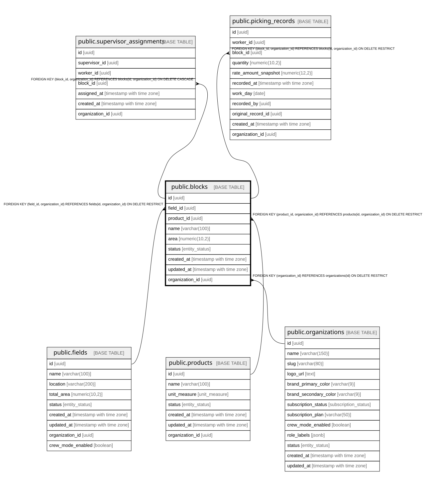

# public.blocks

## Description

Block/paño - subdivision of a field, linked to a product

## Columns

| Name            | Type                     | Default                 | Nullable | Children                                                                                                              | Parents                                                                                                                 | Comment |
| --------------- | ------------------------ | ----------------------- | -------- | --------------------------------------------------------------------------------------------------------------------- | ----------------------------------------------------------------------------------------------------------------------- | ------- |
| id              | uuid                     | gen_random_uuid()       | false    | [public.supervisor_assignments](public.supervisor_assignments.md) [public.picking_records](public.picking_records.md) |                                                                                                                         |         |
| field_id        | uuid                     |                         | false    |                                                                                                                       | [public.fields](public.fields.md)                                                                                       |         |
| product_id      | uuid                     |                         | false    |                                                                                                                       | [public.products](public.products.md)                                                                                   |         |
| name            | varchar(100)             |                         | false    |                                                                                                                       |                                                                                                                         |         |
| area            | numeric(10,2)            |                         | false    |                                                                                                                       |                                                                                                                         |         |
| status          | entity_status            | 'active'::entity_status | false    |                                                                                                                       |                                                                                                                         |         |
| created_at      | timestamp with time zone | now()                   | false    |                                                                                                                       |                                                                                                                         |         |
| updated_at      | timestamp with time zone | now()                   | false    |                                                                                                                       |                                                                                                                         |         |
| organization_id | uuid                     |                         | false    | [public.supervisor_assignments](public.supervisor_assignments.md) [public.picking_records](public.picking_records.md) | [public.organizations](public.organizations.md) [public.products](public.products.md) [public.fields](public.fields.md) |         |

## Constraints

| Name                        | Type        | Definition                                                                                            |
| --------------------------- | ----------- | ----------------------------------------------------------------------------------------------------- |
| blocks_area_check           | CHECK       | CHECK ((area > (0)::numeric))                                                                         |
| blocks_pkey                 | PRIMARY KEY | PRIMARY KEY (id)                                                                                      |
| blocks_organization_id_fkey | FOREIGN KEY | FOREIGN KEY (organization_id) REFERENCES organizations(id) ON DELETE RESTRICT                         |
| fk_blocks_product_org       | FOREIGN KEY | FOREIGN KEY (product_id, organization_id) REFERENCES products(id, organization_id) ON DELETE RESTRICT |
| fk_blocks_field_org         | FOREIGN KEY | FOREIGN KEY (field_id, organization_id) REFERENCES fields(id, organization_id) ON DELETE RESTRICT     |
| uq_blocks_id_org            | UNIQUE      | UNIQUE (id, organization_id)                                                                          |

## Indexes

| Name                    | Definition                                                                              |
| ----------------------- | --------------------------------------------------------------------------------------- |
| blocks_pkey             | CREATE UNIQUE INDEX blocks_pkey ON public.blocks USING btree (id)                       |
| idx_blocks_field_id     | CREATE INDEX idx_blocks_field_id ON public.blocks USING btree (field_id)                |
| idx_blocks_product_id   | CREATE INDEX idx_blocks_product_id ON public.blocks USING btree (product_id)            |
| idx_blocks_status       | CREATE INDEX idx_blocks_status ON public.blocks USING btree (status)                    |
| idx_blocks_organization | CREATE INDEX idx_blocks_organization ON public.blocks USING btree (organization_id)     |
| uq_blocks_id_org        | CREATE UNIQUE INDEX uq_blocks_id_org ON public.blocks USING btree (id, organization_id) |

## Triggers

| Name                  | Definition                                                                                                                   |
| --------------------- | ---------------------------------------------------------------------------------------------------------------------------- |
| trg_blocks_updated_at | CREATE TRIGGER trg_blocks_updated_at BEFORE UPDATE ON public.blocks FOR EACH ROW EXECUTE FUNCTION update_updated_at_column() |

## Relations

---

> Generated by [tbls](https://github.com/k1LoW/tbls)
