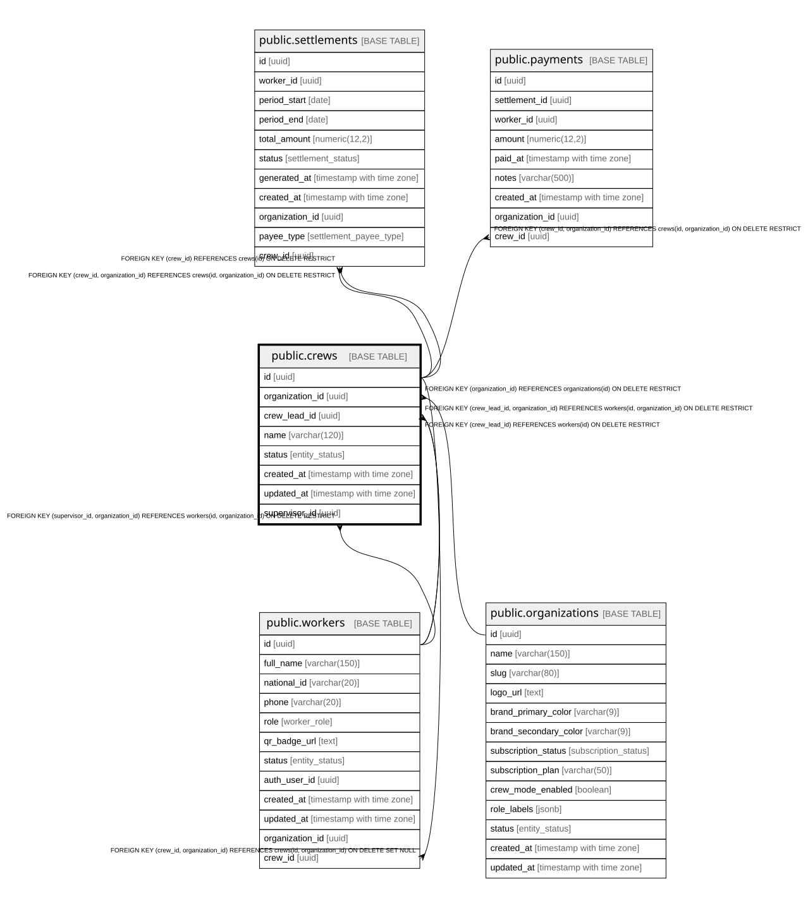

# public.crews

## Description

Cuadrilla de trabajadores gestionada por un Encargado (crew_lead). Solo con Modo Capataz activo.

## Columns

| Name            | Type                     | Default                 | Nullable | Children                                                                        | Parents                                                                             | Comment                                               |
| --------------- | ------------------------ | ----------------------- | -------- | ------------------------------------------------------------------------------- | ----------------------------------------------------------------------------------- | ----------------------------------------------------- |
| id              | uuid                     | gen_random_uuid()       | false    | [public.workers](public.workers.md) [public.settlements](public.settlements.md) |                                                                                     |                                                       |
| organization_id | uuid                     |                         | false    | [public.workers](public.workers.md) [public.settlements](public.settlements.md) | [public.organizations](public.organizations.md) [public.workers](public.workers.md) |                                                       |
| crew_lead_id    | uuid                     |                         | false    |                                                                                 | [public.workers](public.workers.md)                                                 | Worker con rol crew_lead responsable de la cuadrilla. |
| name            | varchar(120)             |                         | false    |                                                                                 |                                                                                     |                                                       |
| status          | entity_status            | 'active'::entity_status | false    |                                                                                 |                                                                                     |                                                       |
| created_at      | timestamp with time zone | now()                   | false    |                                                                                 |                                                                                     |                                                       |
| updated_at      | timestamp with time zone | now()                   | false    |                                                                                 |                                                                                     |                                                       |

## Constraints

| Name                       | Type        | Definition                                                                                             |
| -------------------------- | ----------- | ------------------------------------------------------------------------------------------------------ |
| crews_crew_lead_id_fkey    | FOREIGN KEY | FOREIGN KEY (crew_lead_id) REFERENCES workers(id) ON DELETE RESTRICT                                   |
| crews_organization_id_fkey | FOREIGN KEY | FOREIGN KEY (organization_id) REFERENCES organizations(id) ON DELETE RESTRICT                          |
| fk_crews_lead_org          | FOREIGN KEY | FOREIGN KEY (crew_lead_id, organization_id) REFERENCES workers(id, organization_id) ON DELETE RESTRICT |
| crews_pkey                 | PRIMARY KEY | PRIMARY KEY (id)                                                                                       |
| uq_crews_id_org            | UNIQUE      | UNIQUE (id, organization_id)                                                                           |

## Indexes

| Name                   | Definition                                                                            |
| ---------------------- | ------------------------------------------------------------------------------------- |
| crews_pkey             | CREATE UNIQUE INDEX crews_pkey ON public.crews USING btree (id)                       |
| idx_crews_organization | CREATE INDEX idx_crews_organization ON public.crews USING btree (organization_id)     |
| idx_crews_lead         | CREATE INDEX idx_crews_lead ON public.crews USING btree (crew_lead_id)                |
| uq_crews_id_org        | CREATE UNIQUE INDEX uq_crews_id_org ON public.crews USING btree (id, organization_id) |

## Triggers

| Name                 | Definition                                                                                                                 |
| -------------------- | -------------------------------------------------------------------------------------------------------------------------- |
| trg_crews_updated_at | CREATE TRIGGER trg_crews_updated_at BEFORE UPDATE ON public.crews FOR EACH ROW EXECUTE FUNCTION update_updated_at_column() |

## Relations

---

> Generated by [tbls](https://github.com/k1LoW/tbls)
