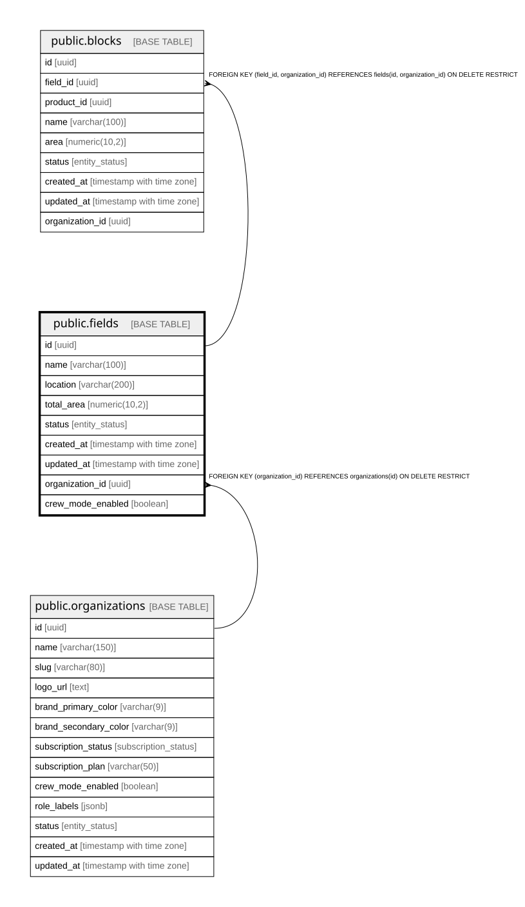

# public.fields

## Description

Farm/fundo - top-level productive unit

## Columns

| Name              | Type                     | Default                 | Nullable | Children                          | Parents                                         | Comment                                                                               |
| ----------------- | ------------------------ | ----------------------- | -------- | --------------------------------- | ----------------------------------------------- | ------------------------------------------------------------------------------------- |
| id                | uuid                     | gen_random_uuid()       | false    | [public.blocks](public.blocks.md) |                                                 |                                                                                       |
| name              | varchar(100)             |                         | false    |                                   |                                                 |                                                                                       |
| location          | varchar(200)             |                         | true     |                                   |                                                 |                                                                                       |
| total_area        | numeric(10,2)            |                         | false    |                                   |                                                 |                                                                                       |
| status            | entity_status            | 'active'::entity_status | false    |                                   |                                                 |                                                                                       |
| created_at        | timestamp with time zone | now()                   | false    |                                   |                                                 |                                                                                       |
| updated_at        | timestamp with time zone | now()                   | false    |                                   |                                                 |                                                                                       |
| organization_id   | uuid                     |                         | false    | [public.blocks](public.blocks.md) | [public.organizations](public.organizations.md) |                                                                                       |
| crew_mode_enabled | boolean                  |                         | true     |                                   |                                                 | Override del Modo Capataz para este campo. NULL hereda el default de la organización. |

## Constraints

| Name                        | Type        | Definition                                                                    |
| --------------------------- | ----------- | ----------------------------------------------------------------------------- |
| fields_total_area_check     | CHECK       | CHECK ((total_area > (0)::numeric))                                           |
| fields_pkey                 | PRIMARY KEY | PRIMARY KEY (id)                                                              |
| fields_organization_id_fkey | FOREIGN KEY | FOREIGN KEY (organization_id) REFERENCES organizations(id) ON DELETE RESTRICT |
| uq_fields_id_org            | UNIQUE      | UNIQUE (id, organization_id)                                                  |

## Indexes

| Name                    | Definition                                                                              |
| ----------------------- | --------------------------------------------------------------------------------------- |
| fields_pkey             | CREATE UNIQUE INDEX fields_pkey ON public.fields USING btree (id)                       |
| idx_fields_status       | CREATE INDEX idx_fields_status ON public.fields USING btree (status)                    |
| idx_fields_organization | CREATE INDEX idx_fields_organization ON public.fields USING btree (organization_id)     |
| uq_fields_id_org        | CREATE UNIQUE INDEX uq_fields_id_org ON public.fields USING btree (id, organization_id) |

## Triggers

| Name                  | Definition                                                                                                                   |
| --------------------- | ---------------------------------------------------------------------------------------------------------------------------- |
| trg_fields_updated_at | CREATE TRIGGER trg_fields_updated_at BEFORE UPDATE ON public.fields FOR EACH ROW EXECUTE FUNCTION update_updated_at_column() |

## Relations

---

> Generated by [tbls](https://github.com/k1LoW/tbls)
