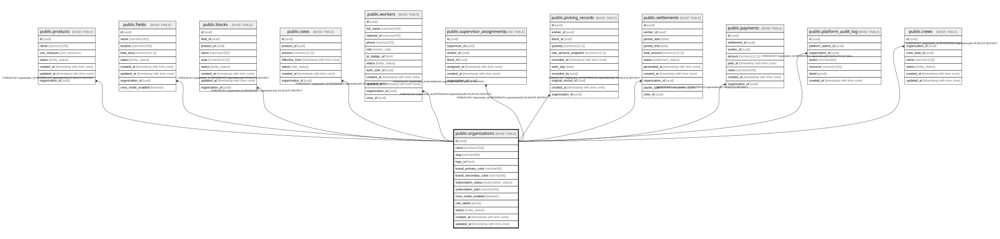

# public.organizations

## Description

Cliente/tenant del SaaS. Unidad de aislamiento de datos.

## Columns

| Name                  | Type                     | Default                      | Nullable | Children                                                                                                                                                                                                                                                                                                                                                                                                                                                                        | Parents | Comment                                                                       |
| --------------------- | ------------------------ | ---------------------------- | -------- | ------------------------------------------------------------------------------------------------------------------------------------------------------------------------------------------------------------------------------------------------------------------------------------------------------------------------------------------------------------------------------------------------------------------------------------------------------------------------------- | ------- | ----------------------------------------------------------------------------- |
| id                    | uuid                     | gen_random_uuid()            | false    | [public.products](public.products.md) [public.fields](public.fields.md) [public.blocks](public.blocks.md) [public.rates](public.rates.md) [public.workers](public.workers.md) [public.supervisor_assignments](public.supervisor_assignments.md) [public.picking_records](public.picking_records.md) [public.settlements](public.settlements.md) [public.payments](public.payments.md) [public.platform_audit_log](public.platform_audit_log.md) [public.crews](public.crews.md) |         |                                                                               |
| name                  | varchar(150)             |                              | false    |                                                                                                                                                                                                                                                                                                                                                                                                                                                                                 |         |                                                                               |
| slug                  | varchar(80)              |                              | false    |                                                                                                                                                                                                                                                                                                                                                                                                                                                                                 |         | Identificador url-safe único de la organización.                              |
| logo_url              | text                     |                              | true     |                                                                                                                                                                                                                                                                                                                                                                                                                                                                                 |         |                                                                               |
| brand_primary_color   | varchar(9)               |                              | true     |                                                                                                                                                                                                                                                                                                                                                                                                                                                                                 |         |                                                                               |
| brand_secondary_color | varchar(9)               |                              | true     |                                                                                                                                                                                                                                                                                                                                                                                                                                                                                 |         |                                                                               |
| subscription_status   | subscription_status      | 'trial'::subscription_status | false    |                                                                                                                                                                                                                                                                                                                                                                                                                                                                                 |         |                                                                               |
| subscription_plan     | varchar(50)              |                              | true     |                                                                                                                                                                                                                                                                                                                                                                                                                                                                                 |         |                                                                               |
| crew_mode_enabled     | boolean                  | false                        | false    |                                                                                                                                                                                                                                                                                                                                                                                                                                                                                 |         | Default de Modo Capataz; cada campo puede sobreescribirlo.                    |
| role_labels           | jsonb                    | '{}'::jsonb                  | false    |                                                                                                                                                                                                                                                                                                                                                                                                                                                                                 |         | Etiquetas de rol configurables para la UI (no altera jerarquía ni seguridad). |
| status                | entity_status            | 'active'::entity_status      | false    |                                                                                                                                                                                                                                                                                                                                                                                                                                                                                 |         |                                                                               |
| created_at            | timestamp with time zone | now()                        | false    |                                                                                                                                                                                                                                                                                                                                                                                                                                                                                 |         |                                                                               |
| updated_at            | timestamp with time zone | now()                        | false    |                                                                                                                                                                                                                                                                                                                                                                                                                                                                                 |         |                                                                               |

## Constraints

| Name                          | Type        | Definition                                                |
| ----------------------------- | ----------- | --------------------------------------------------------- |
| chk_organizations_role_labels | CHECK       | CHECK ((jsonb_typeof(role_labels) = 'object'::text))      |
| chk_organizations_slug        | CHECK       | CHECK (((slug)::text ~ '^[a-z0-9]+(-[a-z0-9]+)*$'::text)) |
| organizations_pkey            | PRIMARY KEY | PRIMARY KEY (id)                                          |
| uq_organizations_slug         | UNIQUE      | UNIQUE (slug)                                             |

## Indexes

| Name                                  | Definition                                                                                                   |
| ------------------------------------- | ------------------------------------------------------------------------------------------------------------ |
| organizations_pkey                    | CREATE UNIQUE INDEX organizations_pkey ON public.organizations USING btree (id)                              |
| uq_organizations_slug                 | CREATE UNIQUE INDEX uq_organizations_slug ON public.organizations USING btree (slug)                         |
| idx_organizations_status              | CREATE INDEX idx_organizations_status ON public.organizations USING btree (status)                           |
| idx_organizations_subscription_status | CREATE INDEX idx_organizations_subscription_status ON public.organizations USING btree (subscription_status) |

## Triggers

| Name                         | Definition                                                                                                                                 |
| ---------------------------- | ------------------------------------------------------------------------------------------------------------------------------------------ |
| trg_organizations_updated_at | CREATE TRIGGER trg_organizations_updated_at BEFORE UPDATE ON public.organizations FOR EACH ROW EXECUTE FUNCTION update_updated_at_column() |

## Relations

---

> Generated by [tbls](https://github.com/k1LoW/tbls)
