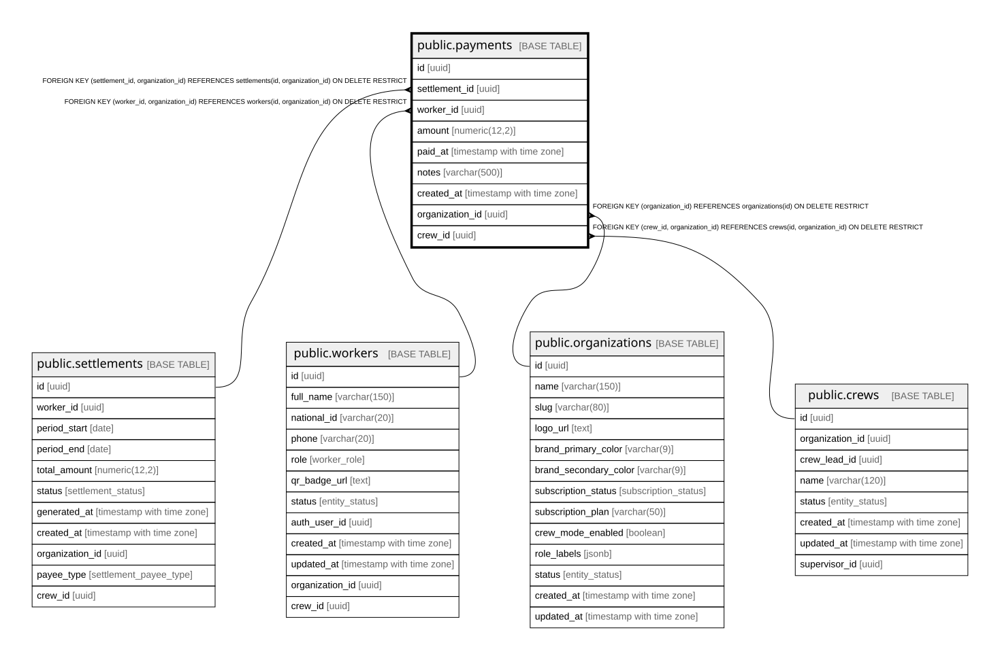

# public.payments

## Description

Actual payments made against settlements.

## Columns

| Name            | Type                     | Default           | Nullable | Children | Parents                                                                                                                                                         | Comment                                                                                                                |
| --------------- | ------------------------ | ----------------- | -------- | -------- | --------------------------------------------------------------------------------------------------------------------------------------------------------------- | ---------------------------------------------------------------------------------------------------------------------- |
| id              | uuid                     | gen_random_uuid() | false    |          |                                                                                                                                                                 |                                                                                                                        |
| settlement_id   | uuid                     |                   | false    |          | [public.settlements](public.settlements.md)                                                                                                                     |                                                                                                                        |
| worker_id       | uuid                     |                   | true     |          | [public.workers](public.workers.md)                                                                                                                             | Trabajador pagado (pago individual). NULL cuando el pago es a una cuadrilla (crew_id set).                             |
| amount          | numeric(12,2)            |                   | false    |          |                                                                                                                                                                 | Must be \> 0 and total payments cannot exceed settlement total_amount.                                                 |
| paid_at         | timestamp with time zone | now()             | false    |          |                                                                                                                                                                 |                                                                                                                        |
| notes           | varchar(500)             |                   | true     |          |                                                                                                                                                                 |                                                                                                                        |
| created_at      | timestamp with time zone | now()             | false    |          |                                                                                                                                                                 |                                                                                                                        |
| organization_id | uuid                     |                   | false    |          | [public.organizations](public.organizations.md) [public.workers](public.workers.md) [public.settlements](public.settlements.md) [public.crews](public.crews.md) |                                                                                                                        |
| crew_id         | uuid                     |                   | true     |          | [public.crews](public.crews.md)                                                                                                                                 | Cuadrilla pagada cuando el pago es del campo al Encargado (contra una liquidación payee_type=crew). XOR con worker_id. |

## Constraints

| Name                          | Type        | Definition                                                                                                   |
| ----------------------------- | ----------- | ------------------------------------------------------------------------------------------------------------ |
| chk_payment_payee             | CHECK       | CHECK ((((worker_id IS NOT NULL) AND (crew_id IS NULL)) OR ((worker_id IS NULL) AND (crew_id IS NOT NULL)))) |
| payments_amount_check         | CHECK       | CHECK ((amount > (0)::numeric))                                                                              |
| payments_pkey                 | PRIMARY KEY | PRIMARY KEY (id)                                                                                             |
| payments_organization_id_fkey | FOREIGN KEY | FOREIGN KEY (organization_id) REFERENCES organizations(id) ON DELETE RESTRICT                                |
| fk_payments_worker_org        | FOREIGN KEY | FOREIGN KEY (worker_id, organization_id) REFERENCES workers(id, organization_id) ON DELETE RESTRICT          |
| fk_payments_settlement_org    | FOREIGN KEY | FOREIGN KEY (settlement_id, organization_id) REFERENCES settlements(id, organization_id) ON DELETE RESTRICT  |
| fk_payments_crew_org          | FOREIGN KEY | FOREIGN KEY (crew_id, organization_id) REFERENCES crews(id, organization_id) ON DELETE RESTRICT              |

## Indexes

| Name                      | Definition                                                                              |
| ------------------------- | --------------------------------------------------------------------------------------- |
| payments_pkey             | CREATE UNIQUE INDEX payments_pkey ON public.payments USING btree (id)                   |
| idx_payments_settlement   | CREATE INDEX idx_payments_settlement ON public.payments USING btree (settlement_id)     |
| idx_payments_worker       | CREATE INDEX idx_payments_worker ON public.payments USING btree (worker_id)             |
| idx_payments_paid_at      | CREATE INDEX idx_payments_paid_at ON public.payments USING btree (paid_at)              |
| idx_payments_organization | CREATE INDEX idx_payments_organization ON public.payments USING btree (organization_id) |
| idx_payments_crew         | CREATE INDEX idx_payments_crew ON public.payments USING btree (crew_id)                 |

## Triggers

| Name                    | Definition                                                                                                                  |
| ----------------------- | --------------------------------------------------------------------------------------------------------------------------- |
| trg_set_org_id_payments | CREATE TRIGGER trg_set_org_id_payments BEFORE INSERT ON public.payments FOR EACH ROW EXECUTE FUNCTION set_organization_id() |

## Relations

---

> Generated by [tbls](https://github.com/k1LoW/tbls)
