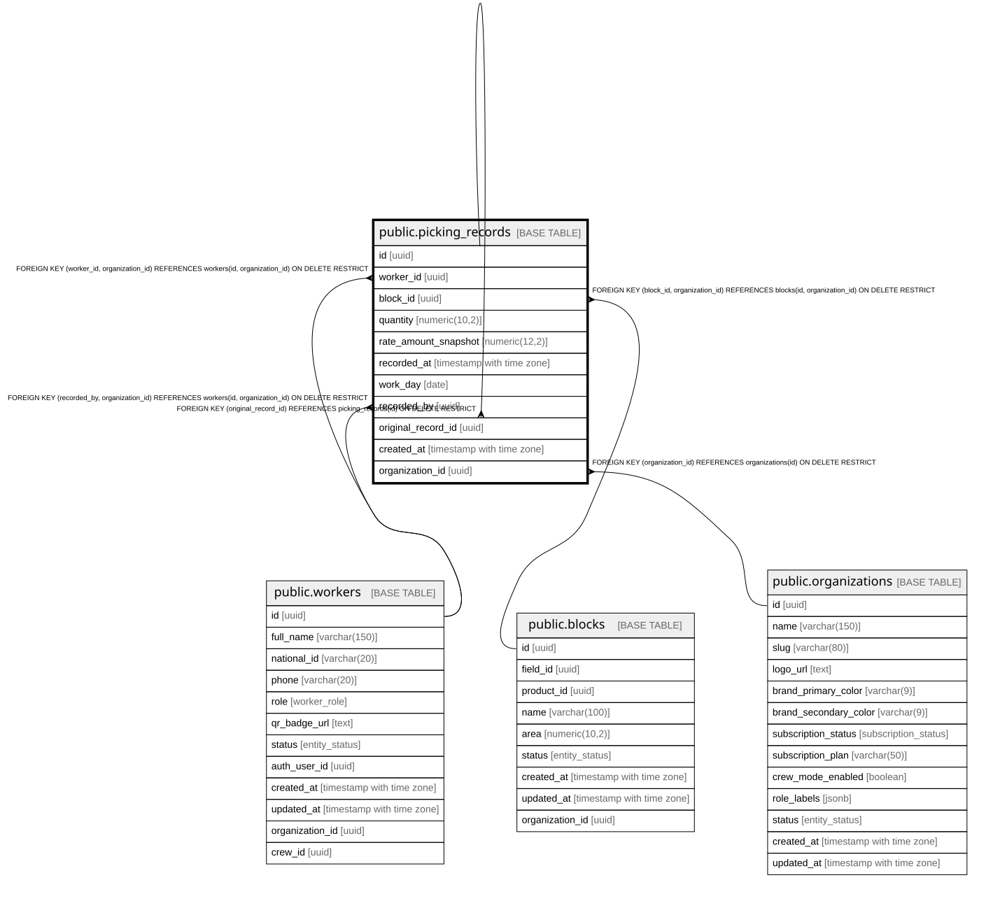

# public.picking_records

## Description

Individual harvest entries. Each record = one delivery of boxes/kg by a worker.

## Columns

| Name                 | Type                     | Default           | Nullable | Children                                            | Parents                                                                                                               | Comment                                                                     |
| -------------------- | ------------------------ | ----------------- | -------- | --------------------------------------------------- | --------------------------------------------------------------------------------------------------------------------- | --------------------------------------------------------------------------- |
| id                   | uuid                     | gen_random_uuid() | false    | [public.picking_records](public.picking_records.md) |                                                                                                                       |                                                                             |
| worker_id            | uuid                     |                   | false    |                                                     | [public.workers](public.workers.md)                                                                                   |                                                                             |
| block_id             | uuid                     |                   | false    |                                                     | [public.blocks](public.blocks.md)                                                                                     |                                                                             |
| quantity             | numeric(10,2)            |                   | false    |                                                     |                                                                                                                       | Units harvested (boxes or kg). Must be \> 0.                                |
| rate_amount_snapshot | numeric(12,2)            |                   | false    |                                                     |                                                                                                                       | Rate frozen at time of recording for traceability.                          |
| recorded_at          | timestamp with time zone | now()             | false    |                                                     |                                                                                                                       |                                                                             |
| work_day             | date                     | CURRENT_DATE      | false    |                                                     |                                                                                                                       |                                                                             |
| recorded_by          | uuid                     |                   | false    |                                                     | [public.workers](public.workers.md)                                                                                   | Supervisor who registered this entry.                                       |
| original_record_id   | uuid                     |                   | true     |                                                     | [public.picking_records](public.picking_records.md)                                                                   | If this is a correction, points to the original record.                     |
| created_at           | timestamp with time zone | now()             | false    |                                                     |                                                                                                                       |                                                                             |
| organization_id      | uuid                     |                   | false    |                                                     | [public.organizations](public.organizations.md) [public.blocks](public.blocks.md) [public.workers](public.workers.md) | Tenant propietario. Debe coincidir con el de worker y block (FK compuesta). |

## Constraints

| Name                                       | Type        | Definition                                                                                            | Comment                                                                        |
| ------------------------------------------ | ----------- | ----------------------------------------------------------------------------------------------------- | ------------------------------------------------------------------------------ |
| picking_records_quantity_check             | CHECK       | CHECK ((quantity > (0)::numeric))                                                                     |                                                                                |
| picking_records_rate_amount_snapshot_check | CHECK       | CHECK ((rate_amount_snapshot > (0)::numeric))                                                         |                                                                                |
| picking_records_original_record_id_fkey    | FOREIGN KEY | FOREIGN KEY (original_record_id) REFERENCES picking_records(id) ON DELETE RESTRICT                    |                                                                                |
| picking_records_pkey                       | PRIMARY KEY | PRIMARY KEY (id)                                                                                      |                                                                                |
| picking_records_organization_id_fkey       | FOREIGN KEY | FOREIGN KEY (organization_id) REFERENCES organizations(id) ON DELETE RESTRICT                         |                                                                                |
| fk_picking_block_org                       | FOREIGN KEY | FOREIGN KEY (block_id, organization_id) REFERENCES blocks(id, organization_id) ON DELETE RESTRICT     | Garantiza que el picking_record y su block pertenecen a la misma organización. |
| fk_picking_recorded_by_org                 | FOREIGN KEY | FOREIGN KEY (recorded_by, organization_id) REFERENCES workers(id, organization_id) ON DELETE RESTRICT |                                                                                |
| fk_picking_worker_org                      | FOREIGN KEY | FOREIGN KEY (worker_id, organization_id) REFERENCES workers(id, organization_id) ON DELETE RESTRICT   |                                                                                |

## Indexes

| Name                             | Definition                                                                                              |
| -------------------------------- | ------------------------------------------------------------------------------------------------------- |
| picking_records_pkey             | CREATE UNIQUE INDEX picking_records_pkey ON public.picking_records USING btree (id)                     |
| idx_picking_records_worker_day   | CREATE INDEX idx_picking_records_worker_day ON public.picking_records USING btree (worker_id, work_day) |
| idx_picking_records_block_day    | CREATE INDEX idx_picking_records_block_day ON public.picking_records USING btree (block_id, work_day)   |
| idx_picking_records_work_day     | CREATE INDEX idx_picking_records_work_day ON public.picking_records USING btree (work_day)              |
| idx_picking_records_recorded_by  | CREATE INDEX idx_picking_records_recorded_by ON public.picking_records USING btree (recorded_by)        |
| idx_picking_records_organization | CREATE INDEX idx_picking_records_organization ON public.picking_records USING btree (organization_id)   |

## Triggers

| Name                           | Definition                                                                                                                                |
| ------------------------------ | ----------------------------------------------------------------------------------------------------------------------------------------- |
| trg_set_org_id_picking_records | CREATE TRIGGER trg_set_org_id_picking_records BEFORE INSERT ON public.picking_records FOR EACH ROW EXECUTE FUNCTION set_organization_id() |

## Relations

---

> Generated by [tbls](https://github.com/k1LoW/tbls)
