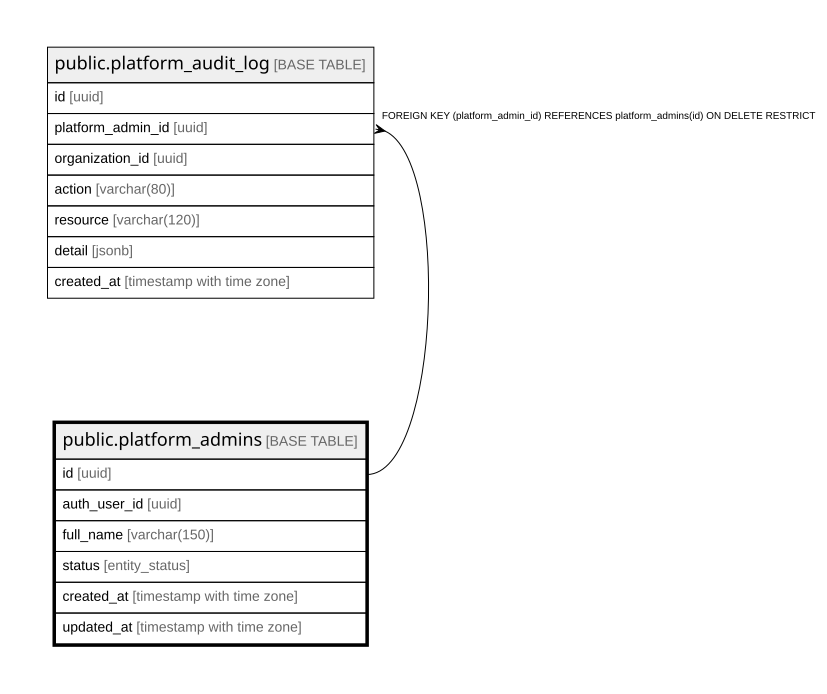

# public.platform_admins

## Description

Administradores de plataforma (dueño/soporte del SaaS). Fuera del aislamiento de tenant.

## Columns

| Name         | Type                     | Default                 | Nullable | Children                                                  | Parents | Comment                                                                                        |
| ------------ | ------------------------ | ----------------------- | -------- | --------------------------------------------------------- | ------- | ---------------------------------------------------------------------------------------------- |
| id           | uuid                     | gen_random_uuid()       | false    | [public.platform_audit_log](public.platform_audit_log.md) |         |                                                                                                |
| auth_user_id | uuid                     |                         | false    |                                                           |         | Vínculo con Supabase Auth. Usado por custom_access_token_hook para el claim is_platform_admin. |
| full_name    | varchar(150)             |                         | false    |                                                           |         |                                                                                                |
| status       | entity_status            | 'active'::entity_status | false    |                                                           |         |                                                                                                |
| created_at   | timestamp with time zone | now()                   | false    |                                                           |         |                                                                                                |
| updated_at   | timestamp with time zone | now()                   | false    |                                                           |         |                                                                                                |

## Constraints

| Name                              | Type        | Definition                                                             |
| --------------------------------- | ----------- | ---------------------------------------------------------------------- |
| platform_admins_auth_user_id_fkey | FOREIGN KEY | FOREIGN KEY (auth_user_id) REFERENCES auth.users(id) ON DELETE CASCADE |
| platform_admins_pkey              | PRIMARY KEY | PRIMARY KEY (id)                                                       |
| platform_admins_auth_user_id_key  | UNIQUE      | UNIQUE (auth_user_id)                                                  |

## Indexes

| Name                             | Definition                                                                                                |
| -------------------------------- | --------------------------------------------------------------------------------------------------------- |
| platform_admins_pkey             | CREATE UNIQUE INDEX platform_admins_pkey ON public.platform_admins USING btree (id)                       |
| platform_admins_auth_user_id_key | CREATE UNIQUE INDEX platform_admins_auth_user_id_key ON public.platform_admins USING btree (auth_user_id) |
| idx_platform_admins_status       | CREATE INDEX idx_platform_admins_status ON public.platform_admins USING btree (status)                    |

## Triggers

| Name                           | Definition                                                                                                                                     |
| ------------------------------ | ---------------------------------------------------------------------------------------------------------------------------------------------- |
| trg_platform_admins_updated_at | CREATE TRIGGER trg_platform_admins_updated_at BEFORE UPDATE ON public.platform_admins FOR EACH ROW EXECUTE FUNCTION update_updated_at_column() |

## Relations

---

> Generated by [tbls](https://github.com/k1LoW/tbls)
