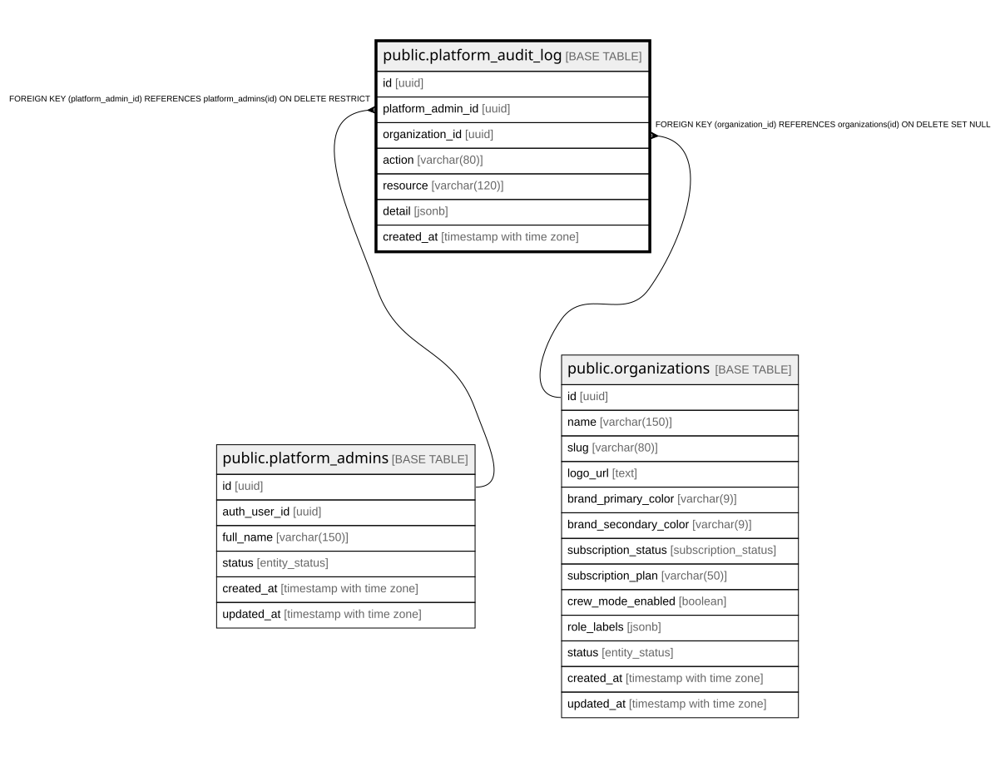

# public.platform_audit_log

## Description

Registro append-only de acciones de plataforma sobre datos de clientes.

## Columns

| Name              | Type                     | Default           | Nullable | Children | Parents                                             | Comment                                                              |
| ----------------- | ------------------------ | ----------------- | -------- | -------- | --------------------------------------------------- | -------------------------------------------------------------------- |
| id                | uuid                     | gen_random_uuid() | false    |          |                                                     |                                                                      |
| platform_admin_id | uuid                     |                   | false    |          | [public.platform_admins](public.platform_admins.md) |                                                                      |
| organization_id   | uuid                     |                   | true     |          | [public.organizations](public.organizations.md)     |                                                                      |
| action            | varchar(80)              |                   | false    |          |                                                     | Acción realizada (impersonate, update_*, change_subscription, etc.). |
| resource          | varchar(120)             |                   | true     |          |                                                     |                                                                      |
| detail            | jsonb                    |                   | true     |          |                                                     | Contexto adicional en JSON (valores previos/nuevos, filtros, etc.).  |
| created_at        | timestamp with time zone | now()             | false    |          |                                                     |                                                                      |

## Constraints

| Name                                      | Type        | Definition                                                                        |
| ----------------------------------------- | ----------- | --------------------------------------------------------------------------------- |
| platform_audit_log_organization_id_fkey   | FOREIGN KEY | FOREIGN KEY (organization_id) REFERENCES organizations(id) ON DELETE SET NULL     |
| platform_audit_log_platform_admin_id_fkey | FOREIGN KEY | FOREIGN KEY (platform_admin_id) REFERENCES platform_admins(id) ON DELETE RESTRICT |
| platform_audit_log_pkey                   | PRIMARY KEY | PRIMARY KEY (id)                                                                  |

## Indexes

| Name                          | Definition                                                                                         |
| ----------------------------- | -------------------------------------------------------------------------------------------------- |
| platform_audit_log_pkey       | CREATE UNIQUE INDEX platform_audit_log_pkey ON public.platform_audit_log USING btree (id)          |
| idx_platform_audit_admin      | CREATE INDEX idx_platform_audit_admin ON public.platform_audit_log USING btree (platform_admin_id) |
| idx_platform_audit_org        | CREATE INDEX idx_platform_audit_org ON public.platform_audit_log USING btree (organization_id)     |
| idx_platform_audit_created_at | CREATE INDEX idx_platform_audit_created_at ON public.platform_audit_log USING btree (created_at)   |

## Relations

---

> Generated by [tbls](https://github.com/k1LoW/tbls)
