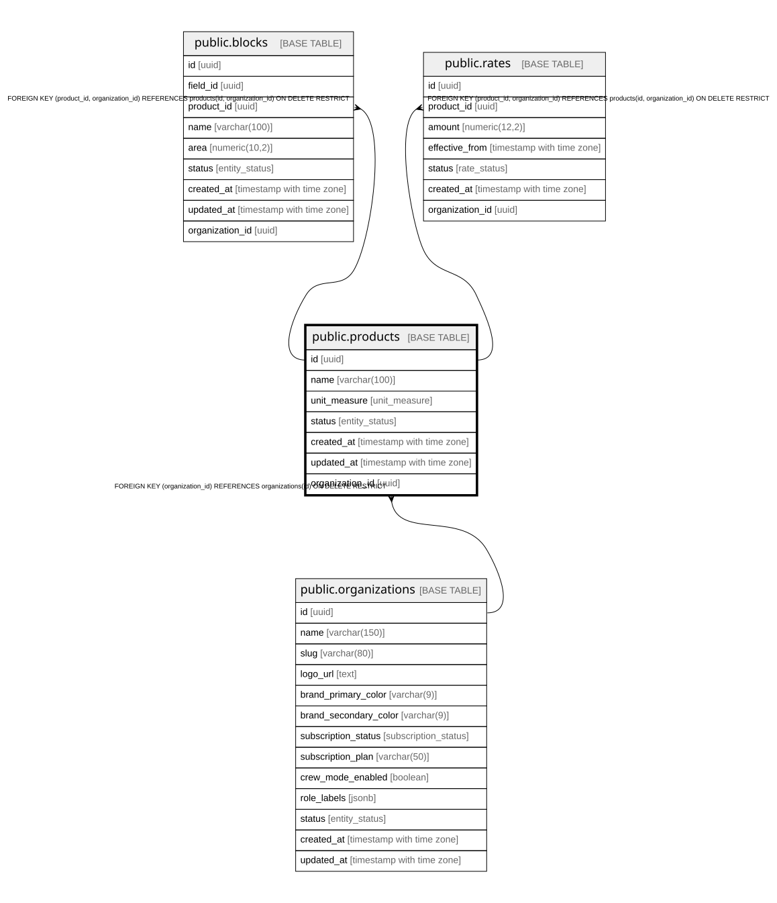

# public.products

## Description

Catalogue of harvestable products (fruit types)

## Columns

| Name            | Type                     | Default                 | Nullable | Children                                                          | Parents                                         | Comment                                           |
| --------------- | ------------------------ | ----------------------- | -------- | ----------------------------------------------------------------- | ----------------------------------------------- | ------------------------------------------------- |
| id              | uuid                     | gen_random_uuid()       | false    | [public.blocks](public.blocks.md) [public.rates](public.rates.md) |                                                 |                                                   |
| name            | varchar(100)             |                         | false    |                                                                   |                                                 |                                                   |
| unit_measure    | unit_measure             |                         | false    |                                                                   |                                                 |                                                   |
| status          | entity_status            | 'active'::entity_status | false    |                                                                   |                                                 |                                                   |
| created_at      | timestamp with time zone | now()                   | false    |                                                                   |                                                 |                                                   |
| updated_at      | timestamp with time zone | now()                   | false    |                                                                   |                                                 |                                                   |
| organization_id | uuid                     |                         | false    | [public.blocks](public.blocks.md) [public.rates](public.rates.md) | [public.organizations](public.organizations.md) | Tenant propietario. Filtro de aislamiento en RLS. |

## Constraints

| Name                          | Type        | Definition                                                                    |
| ----------------------------- | ----------- | ----------------------------------------------------------------------------- |
| products_pkey                 | PRIMARY KEY | PRIMARY KEY (id)                                                              |
| products_organization_id_fkey | FOREIGN KEY | FOREIGN KEY (organization_id) REFERENCES organizations(id) ON DELETE RESTRICT |
| uq_products_id_org            | UNIQUE      | UNIQUE (id, organization_id)                                                  |

## Indexes

| Name                      | Definition                                                                                  |
| ------------------------- | ------------------------------------------------------------------------------------------- |
| products_pkey             | CREATE UNIQUE INDEX products_pkey ON public.products USING btree (id)                       |
| idx_products_status       | CREATE INDEX idx_products_status ON public.products USING btree (status)                    |
| idx_products_organization | CREATE INDEX idx_products_organization ON public.products USING btree (organization_id)     |
| uq_products_id_org        | CREATE UNIQUE INDEX uq_products_id_org ON public.products USING btree (id, organization_id) |

## Triggers

| Name                    | Definition                                                                                                                       |
| ----------------------- | -------------------------------------------------------------------------------------------------------------------------------- |
| trg_products_updated_at | CREATE TRIGGER trg_products_updated_at BEFORE UPDATE ON public.products FOR EACH ROW EXECUTE FUNCTION update_updated_at_column() |

## Relations

---

> Generated by [tbls](https://github.com/k1LoW/tbls)
