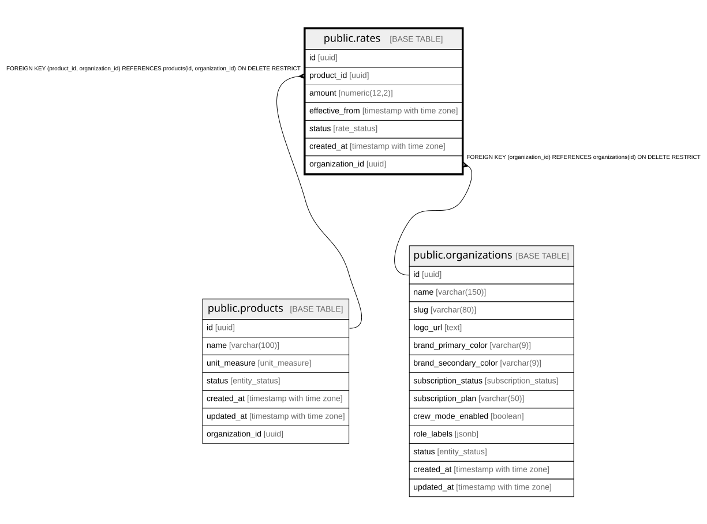

# public.rates

## Description

Price rates per unit (box/kg) for each product. Only one current rate per product at any time.

## Columns

| Name            | Type                     | Default                | Nullable | Children | Parents                                                                               | Comment                                                |
| --------------- | ------------------------ | ---------------------- | -------- | -------- | ------------------------------------------------------------------------------------- | ------------------------------------------------------ |
| id              | uuid                     | gen_random_uuid()      | false    |          |                                                                                       |                                                        |
| product_id      | uuid                     |                        | false    |          | [public.products](public.products.md)                                                 |                                                        |
| amount          | numeric(12,2)            |                        | false    |          |                                                                                       | Must be \> 0. Represents payment per unit (box or kg). |
| effective_from  | timestamp with time zone | now()                  | false    |          |                                                                                       |                                                        |
| status          | rate_status              | 'current'::rate_status | false    |          |                                                                                       |                                                        |
| created_at      | timestamp with time zone | now()                  | false    |          |                                                                                       |                                                        |
| organization_id | uuid                     |                        | false    |          | [public.organizations](public.organizations.md) [public.products](public.products.md) |                                                        |

## Constraints

| Name                       | Type        | Definition                                                                                            |
| -------------------------- | ----------- | ----------------------------------------------------------------------------------------------------- |
| rates_amount_check         | CHECK       | CHECK ((amount > (0)::numeric))                                                                       |
| rates_pkey                 | PRIMARY KEY | PRIMARY KEY (id)                                                                                      |
| rates_organization_id_fkey | FOREIGN KEY | FOREIGN KEY (organization_id) REFERENCES organizations(id) ON DELETE RESTRICT                         |
| fk_rates_product_org       | FOREIGN KEY | FOREIGN KEY (product_id, organization_id) REFERENCES products(id, organization_id) ON DELETE RESTRICT |

## Indexes

| Name                      | Definition                                                                                                                     |
| ------------------------- | ------------------------------------------------------------------------------------------------------------------------------ |
| rates_pkey                | CREATE UNIQUE INDEX rates_pkey ON public.rates USING btree (id)                                                                |
| idx_rates_product_status  | CREATE INDEX idx_rates_product_status ON public.rates USING btree (product_id, status)                                         |
| idx_rates_product_current | CREATE UNIQUE INDEX idx_rates_product_current ON public.rates USING btree (product_id) WHERE (status = 'current'::rate_status) |
| idx_rates_organization    | CREATE INDEX idx_rates_organization ON public.rates USING btree (organization_id)                                              |

## Triggers

| Name                 | Definition                                                                                                            |
| -------------------- | --------------------------------------------------------------------------------------------------------------------- |
| trg_set_org_id_rates | CREATE TRIGGER trg_set_org_id_rates BEFORE INSERT ON public.rates FOR EACH ROW EXECUTE FUNCTION set_organization_id() |

## Relations

---

> Generated by [tbls](https://github.com/k1LoW/tbls)
