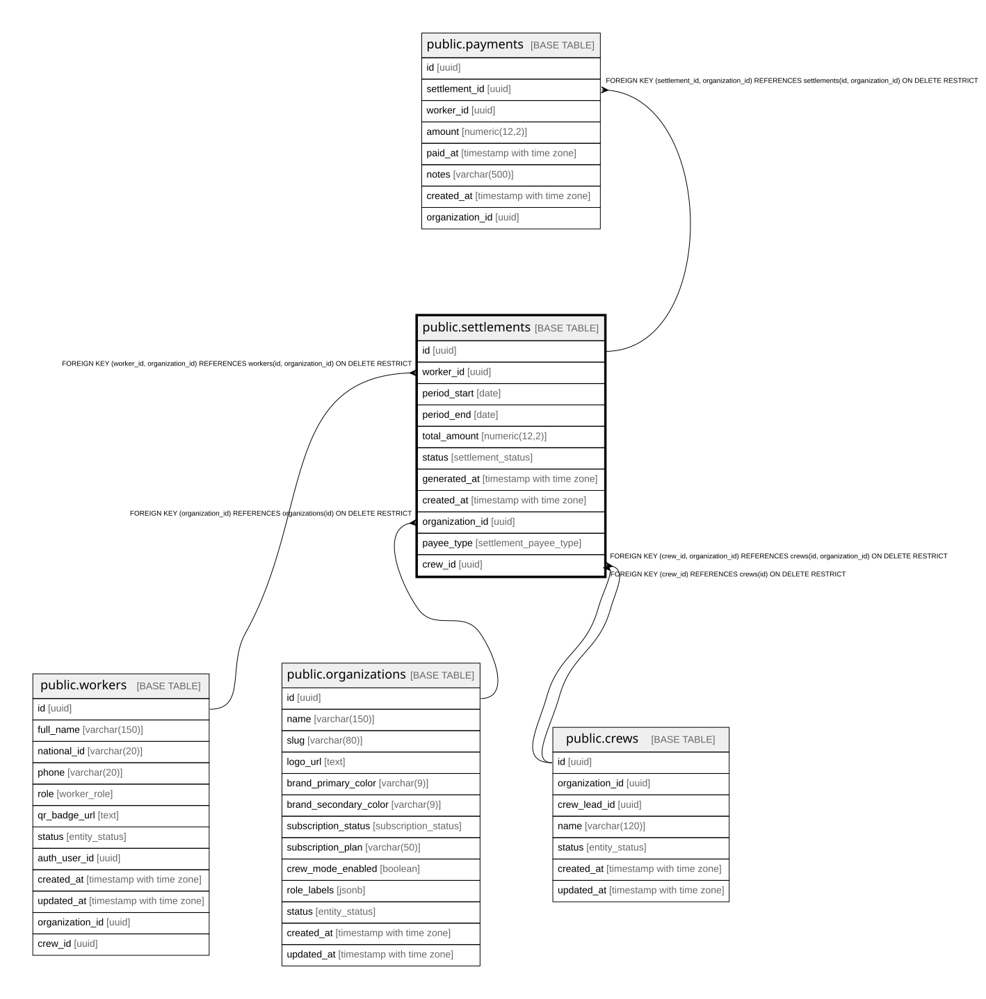

# public.settlements

## Description

Calculated payment due for a worker over a date range.

## Columns

| Name            | Type                     | Default                         | Nullable | Children                              | Parents                                                                                                             | Comment                                                                         |
| --------------- | ------------------------ | ------------------------------- | -------- | ------------------------------------- | ------------------------------------------------------------------------------------------------------------------- | ------------------------------------------------------------------------------- |
| id              | uuid                     | gen_random_uuid()               | false    | [public.payments](public.payments.md) |                                                                                                                     |                                                                                 |
| worker_id       | uuid                     |                                 | true     |                                       | [public.workers](public.workers.md)                                                                                 |                                                                                 |
| period_start    | date                     |                                 | false    |                                       |                                                                                                                     |                                                                                 |
| period_end      | date                     |                                 | false    |                                       |                                                                                                                     |                                                                                 |
| total_amount    | numeric(12,2)            |                                 | false    |                                       |                                                                                                                     | Sum of (quantity * rate_snapshot) for all picking records in the period.        |
| status          | settlement_status        | 'pending'::settlement_status    | false    |                                       |                                                                                                                     |                                                                                 |
| generated_at    | timestamp with time zone | now()                           | false    |                                       |                                                                                                                     |                                                                                 |
| created_at      | timestamp with time zone | now()                           | false    |                                       |                                                                                                                     |                                                                                 |
| organization_id | uuid                     |                                 | false    | [public.payments](public.payments.md) | [public.organizations](public.organizations.md) [public.workers](public.workers.md) [public.crews](public.crews.md) |                                                                                 |
| payee_type      | settlement_payee_type    | 'worker'::settlement_payee_type | false    |                                       |                                                                                                                     | Sujeto de pago: worker (individual) o crew (cuadrilla, a nombre del encargado). |
| crew_id         | uuid                     |                                 | true     |                                       | [public.crews](public.crews.md)                                                                                     | Cuadrilla liquidada cuando payee_type=crew (nivel 1: cliente-\>encargado).      |

## Constraints

| Name                             | Type        | Definition                                                                                                                                                                                                       |
| -------------------------------- | ----------- | ---------------------------------------------------------------------------------------------------------------------------------------------------------------------------------------------------------------- |
| chk_settlement_payee             | CHECK       | CHECK ((((payee_type = 'worker'::settlement_payee_type) AND (worker_id IS NOT NULL) AND (crew_id IS NULL)) OR ((payee_type = 'crew'::settlement_payee_type) AND (crew_id IS NOT NULL) AND (worker_id IS NULL)))) |
| chk_settlement_period            | CHECK       | CHECK ((period_end >= period_start))                                                                                                                                                                             |
| settlements_total_amount_check   | CHECK       | CHECK ((total_amount >= (0)::numeric))                                                                                                                                                                           |
| settlements_pkey                 | PRIMARY KEY | PRIMARY KEY (id)                                                                                                                                                                                                 |
| settlements_organization_id_fkey | FOREIGN KEY | FOREIGN KEY (organization_id) REFERENCES organizations(id) ON DELETE RESTRICT                                                                                                                                    |
| fk_settlements_worker_org        | FOREIGN KEY | FOREIGN KEY (worker_id, organization_id) REFERENCES workers(id, organization_id) ON DELETE RESTRICT                                                                                                              |
| uq_settlements_id_org            | UNIQUE      | UNIQUE (id, organization_id)                                                                                                                                                                                     |
| settlements_crew_id_fkey         | FOREIGN KEY | FOREIGN KEY (crew_id) REFERENCES crews(id) ON DELETE RESTRICT                                                                                                                                                    |
| fk_settlements_crew_org          | FOREIGN KEY | FOREIGN KEY (crew_id, organization_id) REFERENCES crews(id, organization_id) ON DELETE RESTRICT                                                                                                                  |

## Indexes

| Name                         | Definition                                                                                                                                                                   |
| ---------------------------- | ---------------------------------------------------------------------------------------------------------------------------------------------------------------------------- |
| settlements_pkey             | CREATE UNIQUE INDEX settlements_pkey ON public.settlements USING btree (id)                                                                                                  |
| idx_settlements_worker       | CREATE INDEX idx_settlements_worker ON public.settlements USING btree (worker_id)                                                                                            |
| idx_settlements_status       | CREATE INDEX idx_settlements_status ON public.settlements USING btree (status)                                                                                               |
| idx_settlements_period       | CREATE INDEX idx_settlements_period ON public.settlements USING btree (period_start, period_end)                                                                             |
| idx_settlements_organization | CREATE INDEX idx_settlements_organization ON public.settlements USING btree (organization_id)                                                                                |
| uq_settlements_id_org        | CREATE UNIQUE INDEX uq_settlements_id_org ON public.settlements USING btree (id, organization_id)                                                                            |
| uq_settlement_worker_period  | CREATE UNIQUE INDEX uq_settlement_worker_period ON public.settlements USING btree (worker_id, period_start, period_end) WHERE (payee_type = 'worker'::settlement_payee_type) |
| uq_settlement_crew_period    | CREATE UNIQUE INDEX uq_settlement_crew_period ON public.settlements USING btree (crew_id, period_start, period_end) WHERE (payee_type = 'crew'::settlement_payee_type)       |
| idx_settlements_crew         | CREATE INDEX idx_settlements_crew ON public.settlements USING btree (crew_id)                                                                                                |

## Triggers

| Name                                | Definition                                                                                                                                            |
| ----------------------------------- | ----------------------------------------------------------------------------------------------------------------------------------------------------- |
| trg_settlements_immutable_when_paid | CREATE TRIGGER trg_settlements_immutable_when_paid BEFORE UPDATE ON public.settlements FOR EACH ROW EXECUTE FUNCTION prevent_paid_settlement_update() |
| trg_set_org_id_settlements          | CREATE TRIGGER trg_set_org_id_settlements BEFORE INSERT ON public.settlements FOR EACH ROW EXECUTE FUNCTION set_organization_id()                     |

## Relations

---

> Generated by [tbls](https://github.com/k1LoW/tbls)
