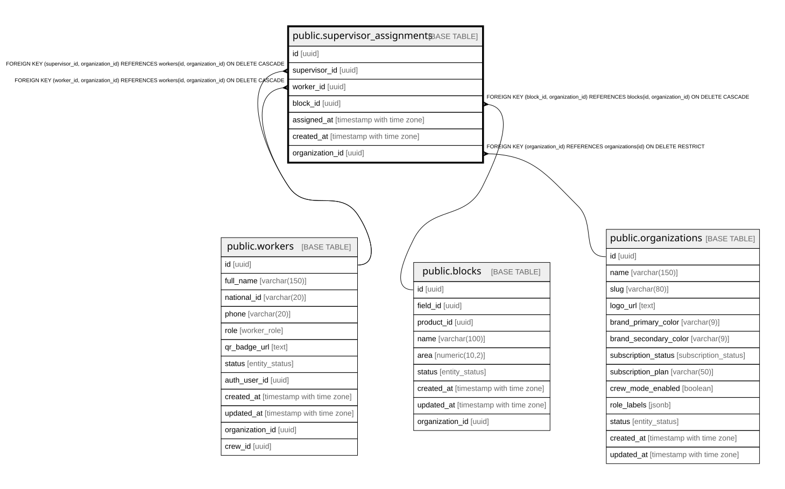

# public.supervisor_assignments

## Description

Maps supervisors to the workers and blocks they manage.

## Columns

| Name            | Type                     | Default           | Nullable | Children | Parents                                                                                                               | Comment |
| --------------- | ------------------------ | ----------------- | -------- | -------- | --------------------------------------------------------------------------------------------------------------------- | ------- |
| id              | uuid                     | gen_random_uuid() | false    |          |                                                                                                                       |         |
| supervisor_id   | uuid                     |                   | false    |          | [public.workers](public.workers.md)                                                                                   |         |
| worker_id       | uuid                     |                   | true     |          | [public.workers](public.workers.md)                                                                                   |         |
| block_id        | uuid                     |                   | true     |          | [public.blocks](public.blocks.md)                                                                                     |         |
| assigned_at     | timestamp with time zone | now()             | false    |          |                                                                                                                       |         |
| created_at      | timestamp with time zone | now()             | false    |          |                                                                                                                       |         |
| organization_id | uuid                     |                   | false    |          | [public.organizations](public.organizations.md) [public.blocks](public.blocks.md) [public.workers](public.workers.md) |         |

## Constraints

| Name                                        | Type        | Definition                                                                                             |
| ------------------------------------------- | ----------- | ------------------------------------------------------------------------------------------------------ |
| chk_assignment_target                       | CHECK       | CHECK (((worker_id IS NOT NULL) OR (block_id IS NOT NULL)))                                            |
| supervisor_assignments_pkey                 | PRIMARY KEY | PRIMARY KEY (id)                                                                                       |
| uq_supervisor_worker                        | UNIQUE      | UNIQUE (supervisor_id, worker_id)                                                                      |
| uq_supervisor_block                         | UNIQUE      | UNIQUE (supervisor_id, block_id)                                                                       |
| supervisor_assignments_organization_id_fkey | FOREIGN KEY | FOREIGN KEY (organization_id) REFERENCES organizations(id) ON DELETE RESTRICT                          |
| fk_assignment_block_org                     | FOREIGN KEY | FOREIGN KEY (block_id, organization_id) REFERENCES blocks(id, organization_id) ON DELETE CASCADE       |
| fk_assignment_supervisor_org                | FOREIGN KEY | FOREIGN KEY (supervisor_id, organization_id) REFERENCES workers(id, organization_id) ON DELETE CASCADE |
| fk_assignment_worker_org                    | FOREIGN KEY | FOREIGN KEY (worker_id, organization_id) REFERENCES workers(id, organization_id) ON DELETE CASCADE     |

## Indexes

| Name                                    | Definition                                                                                                          |
| --------------------------------------- | ------------------------------------------------------------------------------------------------------------------- |
| supervisor_assignments_pkey             | CREATE UNIQUE INDEX supervisor_assignments_pkey ON public.supervisor_assignments USING btree (id)                   |
| uq_supervisor_worker                    | CREATE UNIQUE INDEX uq_supervisor_worker ON public.supervisor_assignments USING btree (supervisor_id, worker_id)    |
| uq_supervisor_block                     | CREATE UNIQUE INDEX uq_supervisor_block ON public.supervisor_assignments USING btree (supervisor_id, block_id)      |
| idx_supervisor_assignments_supervisor   | CREATE INDEX idx_supervisor_assignments_supervisor ON public.supervisor_assignments USING btree (supervisor_id)     |
| idx_supervisor_assignments_worker       | CREATE INDEX idx_supervisor_assignments_worker ON public.supervisor_assignments USING btree (worker_id)             |
| idx_supervisor_assignments_block        | CREATE INDEX idx_supervisor_assignments_block ON public.supervisor_assignments USING btree (block_id)               |
| idx_supervisor_assignments_organization | CREATE INDEX idx_supervisor_assignments_organization ON public.supervisor_assignments USING btree (organization_id) |

## Triggers

| Name                                  | Definition                                                                                                                                              |
| ------------------------------------- | ------------------------------------------------------------------------------------------------------------------------------------------------------- |
| trg_set_org_id_supervisor_assignments | CREATE TRIGGER trg_set_org_id_supervisor_assignments BEFORE INSERT ON public.supervisor_assignments FOR EACH ROW EXECUTE FUNCTION set_organization_id() |

## Relations

---

> Generated by [tbls](https://github.com/k1LoW/tbls)
