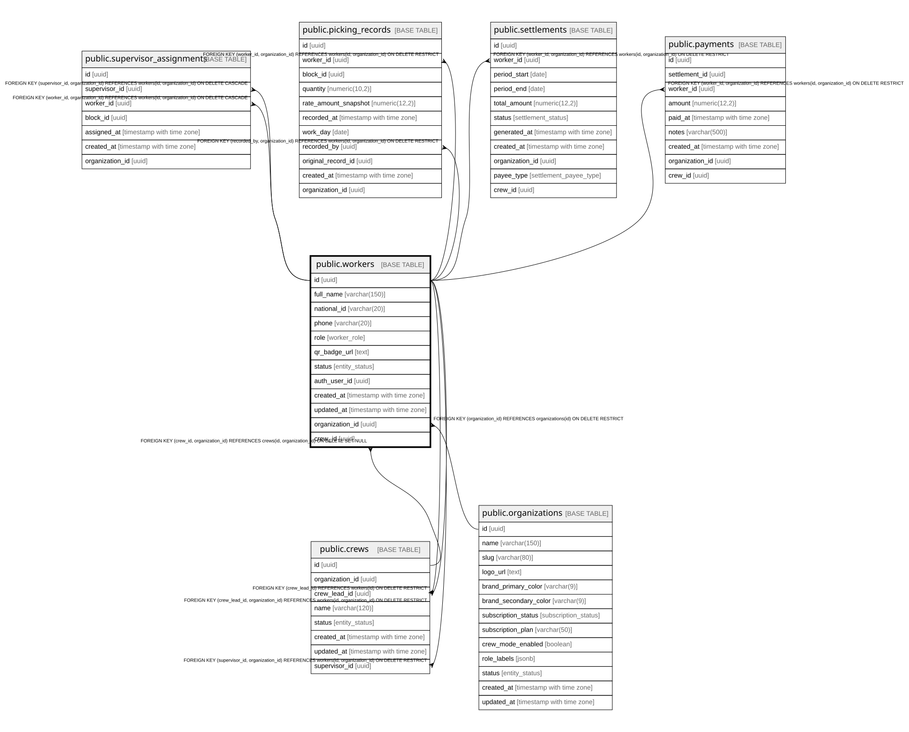

# public.workers

## Description

Farm workers, supervisors, and admins. Linked to Supabase Auth.

## Columns

| Name            | Type                     | Default                 | Nullable | Children                                                                                                                                                                                                                                | Parents                                                                         | Comment                                                                       |
| --------------- | ------------------------ | ----------------------- | -------- | --------------------------------------------------------------------------------------------------------------------------------------------------------------------------------------------------------------------------------------- | ------------------------------------------------------------------------------- | ----------------------------------------------------------------------------- |
| id              | uuid                     | gen_random_uuid()       | false    | [public.supervisor_assignments](public.supervisor_assignments.md) [public.picking_records](public.picking_records.md) [public.settlements](public.settlements.md) [public.payments](public.payments.md) [public.crews](public.crews.md) |                                                                                 |                                                                               |
| full_name       | varchar(150)             |                         | false    |                                                                                                                                                                                                                                         |                                                                                 |                                                                               |
| national_id     | varchar(20)              |                         | true     |                                                                                                                                                                                                                                         |                                                                                 | RUT or national ID. Encrypted at rest by Supabase.                            |
| phone           | varchar(20)              |                         | true     |                                                                                                                                                                                                                                         |                                                                                 |                                                                               |
| role            | worker_role              | 'worker'::worker_role   | false    |                                                                                                                                                                                                                                         |                                                                                 |                                                                               |
| qr_badge_url    | text                     |                         | true     |                                                                                                                                                                                                                                         |                                                                                 | URL to QR badge image in Supabase Storage.                                    |
| status          | entity_status            | 'active'::entity_status | false    |                                                                                                                                                                                                                                         |                                                                                 |                                                                               |
| auth_user_id    | uuid                     |                         | true     |                                                                                                                                                                                                                                         |                                                                                 |                                                                               |
| created_at      | timestamp with time zone | now()                   | false    |                                                                                                                                                                                                                                         |                                                                                 |                                                                               |
| updated_at      | timestamp with time zone | now()                   | false    |                                                                                                                                                                                                                                         |                                                                                 |                                                                               |
| organization_id | uuid                     |                         | false    | [public.supervisor_assignments](public.supervisor_assignments.md) [public.picking_records](public.picking_records.md) [public.settlements](public.settlements.md) [public.payments](public.payments.md) [public.crews](public.crews.md) | [public.organizations](public.organizations.md) [public.crews](public.crews.md) | Tenant propietario. Filtro de aislamiento en RLS.                             |
| crew_id         | uuid                     |                         | true     |                                                                                                                                                                                                                                         | [public.crews](public.crews.md)                                                 | Cuadrilla a la que pertenece el trabajador (Modo Capataz). NULL si no aplica. |

## Constraints

| Name                         | Type        | Definition                                                                                      |
| ---------------------------- | ----------- | ----------------------------------------------------------------------------------------------- |
| workers_auth_user_id_fkey    | FOREIGN KEY | FOREIGN KEY (auth_user_id) REFERENCES auth.users(id) ON DELETE SET NULL                         |
| workers_pkey                 | PRIMARY KEY | PRIMARY KEY (id)                                                                                |
| workers_auth_user_id_key     | UNIQUE      | UNIQUE (auth_user_id)                                                                           |
| workers_organization_id_fkey | FOREIGN KEY | FOREIGN KEY (organization_id) REFERENCES organizations(id) ON DELETE RESTRICT                   |
| uq_workers_id_org            | UNIQUE      | UNIQUE (id, organization_id)                                                                    |
| fk_workers_crew_org          | FOREIGN KEY | FOREIGN KEY (crew_id, organization_id) REFERENCES crews(id, organization_id) ON DELETE SET NULL |

## Indexes

| Name                     | Definition                                                                                |
| ------------------------ | ----------------------------------------------------------------------------------------- |
| workers_pkey             | CREATE UNIQUE INDEX workers_pkey ON public.workers USING btree (id)                       |
| workers_auth_user_id_key | CREATE UNIQUE INDEX workers_auth_user_id_key ON public.workers USING btree (auth_user_id) |
| idx_workers_status       | CREATE INDEX idx_workers_status ON public.workers USING btree (status)                    |
| idx_workers_role         | CREATE INDEX idx_workers_role ON public.workers USING btree (role)                        |
| idx_workers_auth_user_id | CREATE INDEX idx_workers_auth_user_id ON public.workers USING btree (auth_user_id)        |
| idx_workers_organization | CREATE INDEX idx_workers_organization ON public.workers USING btree (organization_id)     |
| uq_workers_id_org        | CREATE UNIQUE INDEX uq_workers_id_org ON public.workers USING btree (id, organization_id) |
| idx_workers_crew         | CREATE INDEX idx_workers_crew ON public.workers USING btree (crew_id)                     |

## Triggers

| Name                   | Definition                                                                                                                     |
| ---------------------- | ------------------------------------------------------------------------------------------------------------------------------ |
| trg_workers_updated_at | CREATE TRIGGER trg_workers_updated_at BEFORE UPDATE ON public.workers FOR EACH ROW EXECUTE FUNCTION update_updated_at_column() |

## Relations

---

> Generated by [tbls](https://github.com/k1LoW/tbls)
